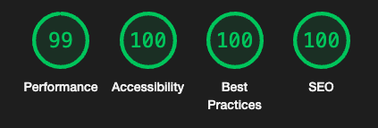
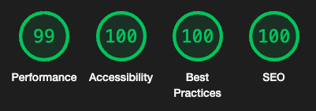
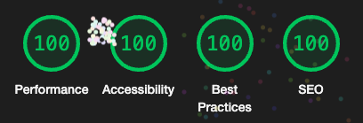
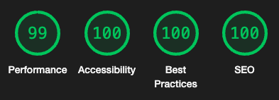

# [Foodie Society](https://lukab25.github.io/Foodie-Society/)

## Introduction

The Foodie Society is a website to help connect with the community united by their shared love and enthusiasm for all things food-related and is open to all like minded individuals.
The Foodie Society is a great resource for inspiration, recipes and tips and tricks that have been tested and are certified to satisfy your tastebuds and improve your cooking skills.

The Foodie Society will offer it's users following information: introduction and details about us, details about our gatherings, meetups and online calls, various recipes and contact information to get in touch and join our community.

## Wireframes

Created using [Balsamiq](https://balsamiq.com)

First sketch on normal size device:

Sketch on tablet or similar size device

Sketch of a phone or similar size device:

## About the build:

### index.html

I started the project and created all of the required pages: index.html, recipes.html, form.html, style.css, including the folders: assets containing css and images folder.
I created the structural layout for the home page:

1. At the top header with navigation bar containing all of the pages the project will have.
2. Hero image section that would contain the details so users would know what is the site for.
3. About section with couple of details explaining who we are and what are the benefits of joining.
4. Meetup and online chats section that will specify the times, dates and possible locations of gatherings.
5. Footer with all of the links for our social media sites and a direct link to a contact form.

Given that the site is food and food lover oriented, I have decided to gather couple of pictures connected to the topic. I checked and used [PixaBay](https://www.pixabay.com) and [Unsplash](https://www.unsplash.com) to get royalty free images.

After making a structural layout of the home page I started coding the site and I used previously learned topics and videos for support to locate certain coding styles. I also used ChatGPT to bounce the ideas around and for help checking if my colour pallete was sufficient enough and for couple of tips on how to construct some code to help me with the task **ie. how to align the image within the element** = actual code: **_display: block; margin-left: auto; margin-right: auto;_**

I made the basic header look and decided to style it later, once my hero image is in place. After adding the hero image I started with styling of the general look and feel of the site, even though I changed it along the way slightly. After succeeding with the header and hero image, I was creating the text for the hero image and ended up struggling slightly, but decided to look up and follow the instructions within the Love Running project, to use the general details and adjust my own changes and styles once I found my mistake. I forgot to set the **position** of the hero image-outer id to **relative**, which didn't allow for my text to align where I wanted it to.

For the about us section I decided to create two articles contained within the div elemeent to contain two paragrafs split by an image and to be centered and aligned with each other.

Next task is to create the meet up section. After choosing and adding an img file I set it as a background and added 5 divs to my meetups section to contain all of the details about our weekly meetups, online classes and exploring of restaurants and coffee houses.
_later_ I realised my links are not opening in a separate tab and that they do not contain explanation for the Screen Readers so I worked on adding the code by implementing: **target="\_blank" rel="noopener" aria-label="xyz(opens in a new tab)"**

While creating the footer. I was struggling with positioning of the social media links as they were automatically aligning to the right in reverse order. I was reserching the ways to reverse the list order and have found a solution on [StackOverflow](https://stackoverflow.com/questions/47031111/displaying-the-list-items-in-reverse-order-using-css) so I used the following code from there and modified it to my needs:
ul {
-moz-transform: rotate(180deg);
-webkit-transform: rotate(180deg);
transform: rotate(180deg);
}

ul > li {
-moz-transform: rotate(-180deg);
-webkit-transform: rotate(-180deg);
transform: rotate(-180deg);
display:inline-block;
}

### recipes.html

I have started the recipes.html by copying the source code from index.html to reuse the body, Header, Hero image and Footer section in the build of the second page of a site. I spent some time informing and making sure I can still reuse all of my elements and that everything is still funcioning, and it did.

I decided to use three recipes that have been in my family and that myself or my family members came up with. The first one is a pizza recipe that is my very own that I have been making for years. The burger recipe is something my husband came up with and perfected over the years.
And the last but still very important to me is a recipe for cream filled profiteroles my mother has been making my whole life. All of the recipes are tested and would recommend to try, but the reason I included them is because I wanted to connect something personal with my project.

In this section I was struggling slightly with getting all of the sizes and ratios working, but I managed to sort it out and I am satisfied with the look of the page and the fact that it matches with the home page.

### form.html

In the beginning of the project I have decided I will not create a separate page for the gallery, but upon starting with the form.html page I have decided to try something I was completely unsure if it will be possible and how will I manage to succeed at creating. I have decided that I will try my best to create my vision.

First I created a gallery, consisting of 12 images, for a help and reference I used the previous lessons and rewatched the Love Running gallery videos. I made sure that all of the images were overlapping and that they were in a good position.

Once the gallery was finished I started creating to form, after revisiting the original forms lessons I started creating the code and slowly it was coming together, but it was still not overlapping on top of the gallery. Couple of google searches later I have realised what was I missing. I forgot to place a **position:relative** onto the gallery and **position:absolute**, as soon as I added the code, the form overlapped on top of the created gallery. I decided to add couple of **hover** animations and finish the form page.

### confirmation.html

During my first meeting with the mentor Dick Vlaanderen, we were discussing the whole project and I was showing him my wireframes and the where I was with my first page partially coded. We were discussing where I was planning to go with this project and he advised me to keep up with the same theme across the whole project, but also to create a forth page, that will only be visible once the form has been sent, instead of being taken to a completely differently styled Code Institute page. Which I loved, I found that idea great, as it completely encapsulates the user experience and brings the site to another level.

In relation to that I decided to just create a simple page with a thank you text on top of the gallery letting the user know that we have received their form. User is stil able to navigate across the whole page.

The site is live at: https://lukab25.github.io/Foodie-Society/

## Testing

Colons can be used to align columns.

|           Action            |                                Expectation                                 | Outcome |
| :-------------------------: | :------------------------------------------------------------------------: | :-----: |
|           Header            |                          Adjusts with screen size                          |  Pass   |
|        Click on logo        |                           Takes you to home page                           |  Pass   |
|       Navigation bar        |                 Active page underlined, adjusts with size                  |  Pass   |
|    Navigation bar - Home    |               Takes you to home page, underlined when active               |  Pass   |
|  Navigation bar - Recipes   |             Takes you to recipes page, underlined when active              |  Pass   |
|    Navigation bar - Form    |               Takes you to form page, underlined when active               |  Pass   |
|    Navigation bar:hover     |                   Changes colour and underlined on hover                   |  Pass   |
|      Click on nav bar       |                   Takes you to selected page (same tab)                    |  Pass   |
|         Hero image          |                          Adjusts with screen size                          |  Pass   |
|          About us           |                          Adjusts with screen size                          |  Pass   |
|       About us images       |                          Adjusts with screen size                          |  Pass   |
|        About us text        | Adjusts with screen size/ reduces to single line with smaller screen sizes |  Pass   |
|    About us icons:hover     |                      Changes colour and size on hover                      |  Pass   |
|           Meetups           |                          Adjust with screen size                           |  Pass   |
|        Meetups text         | Adjusts with screen size/ reduces to single line with smaller screen sizes |  Pass   |
|     Meetups icons:hover     |                      Changes colour and size on hover                      |  Pass   |
|    Meetups twitch links     |                         Opens site in separate tab                         |  Pass   |
|     Meetups skype link      |                         Opens site in separate tab                         |  Pass   |
|     Meetups coffee link     |                         Opens site in separate tab                         |  Pass   |
|  Meetups restaurant links   |                         Opens site in separate tab                         |  Pass   |
|           Recipes           |                          Adjusts with screen size                          |  Pass   |
|        Recipes text         | Adjusts with screen size/ reduces to single line with smaller screen sizes |  Pass   |
|       Recipes images        |                          Adjusts with screen size                          |  Pass   |
|     Recipes icons:hover     |                      Changes colour and size on hover                      |  Pass   |
|            Form             |                          Adjust with screen size                           |  Pass   |
|          Form text          |                          Adjusts with screen size                          |  Pass   |
|      Form icons:hover       |                      Changes colour and size on hover                      |  Pass   |
|       Form submition        |         Opens confirmation page with the same styling in same tab          |  Pass   |
|     Gallery background      |            Adjusts size and number of columns with screen size             |  Pass   |
|        Confirmation         |          Adjusts with screen size, has same styling as form page           |  Pass   |
|   Confirmation navigation   |        Allows you to navigate through the site same as other pages         |  Pass   |
|           Footers           |                          Adjust with screen size                           |  Pass   |
|     Footer icons:hover      |                      Changes colour and size on hover                      |  Pass   |
|    Footer Facebook icon     |                    Opens Facebook site in separate tab                     |  Pass   |
|    Footer Instagram icon    |                    Opens Instagram site in separate tab                    |  Pass   |
|    Footer Pinterest icon    |                    Opens Pinterest site in separate tab                    |  Pass   |
|     Footer Twitter icon     |                     Opens Twitter site in separate tab                     |  Pass   |
|     Footer Youtube icon     |                     Opens Youtube site in separate tab                     |  Pass   |
| Footer Code Institute link  |                 Opens Code Institute site in separate tab                  |  Pass   |
| Footer Code institute:hover |                          Changes colour on hover                           |  Pass   |
|   Footer Luka Black link    |                     Opens my LinkedIn in separate tab                      |  Pass   |
|   Footer Luka Black:hover   |                          Changes colour on hover                           |  Pass   |
|      Footer Form icon       |                      Opens Form site in separate tab                       |  Pass   |
|     Footer Twitch icon      |                     Opens Twitch site in separate tab                      |  Pass   |
|      Footer Skype icon      |                      Opens Skype site in separate tab                      |  Pass   |
|     Footer Twitch icon      |                     Opens Twitch site in separate tab                      |  Pass   |
|     Home responsivness      |               Home page fully responsive with screen changes               |  Pass   |
|    Recipes responsivness    |             Recipes page fully responsive with screen changes              |  Pass   |
|    Contact responsivness    |               Form page fully responsive with screen changes               |  Pass   |
| Confirmation responsivness  |           Confirmation page fully responsive with screen changes           |  Pass   |

## Troubleshooting

After couple of days of coding and doing final add ons onto the home page I have realized I haven't included aria-label for the main logo, navigation menu and in the paragraph within footer. So I worked on adding all of them and making sure all links have a aria-label.

Did some w3 and w3c validator and lighthouse testing corrected the code. There was couple of unnecessary </i> tags, removed the span from the code, as I was using ul in the same section. Had 1 error in the CSS code, which was an extra border word in the text-decoration styling, corrected it.

I had an issue in the lighthouse with slow responce due to the large image files, so I corrected them by converting the pictures to avif file and resizing them.

I worked on responsiveness by adding the media queries and improving all of the different aspects that were necessary with various screen changes. I had to do some troubleshooting in regards of: navigation bar falling apart with smaller screen sizes - set up the parameters to have navigation bar transfer into second line, but still being adjusted to the right; hero image text getting out of pre set size parameters - added new parameters to adjust to different screen sizes; About us and recipes section not optimal for smaller screen sizes - aligned each of the articles into one central line, so they sit one after another to be more user friendly; footer starting to overlap and started looking miss aligned on smaller screens - added parameters to reduce the size of icons and text, and separate into two lines on even smaller screens; form being to small and narrow for smaller screens - reduced the left margins and expanded the width of the form window to improve experience; gallery pictures underneath the form were too small on smaller devices - used the knowledge from the previous lessons to adjust the columns to improve the gallery background.

As of today still need to do responsiveness adjustments and figure out how to add pictures to the readme file and ready then I am ready to book my 2nd mentors meeting.

Did some troubleshooting of the site and discovered the h2 element under each of the recipes containing _Bon Appetit._ was not centered properly for the first two recipes, fixed them by adding additional padding underneath the ordered list on the right.

After deployment of the site I found out that the hero image and the meetups background image were not updating, so I took some time trying to figure out what what the issue. I discovered that the images were not loading because they were within the style.css file and they didn't have a proper directory set up. Instead of setting them up to go one directory up and then access the images folder I was trying to add them the same way I added the img files within the html by going through the /assets/images pathway and the way to fix it was to replace the assets with ../images pathway.

After setting up media queries for responsiveness I found out that the recipes page was not responsive and was falling apart with sizes smaller that 525px. After hours of troubleshooting and trying to figure it out I discovered that the article had no specified container and the circle-container that held the images were not working optimally on the small screen sizes so I tryed a lot of different techniques, but discovered that the best option is to remove the circle-container boundaries and border set the image size to auto, so it can adjust more easily on such small screen size. I also added the article width and height to make sure it is not going out of alignement with other sections.

## Deployment

Steps:

1. Open my repository [Foodie Society github](https://github.com/LukaB25/Foodie-Society).
2. Go to settings.
3. Locate Pages in the menu section on the left of the screen.
4. Click on none under the Branch and select main option.
5. Click on the save button.
6. After couple of minutes reload the page and you will have a live site at the top of the site.
7. Click on the link and it will take you to a live site. [My live site](https://lukab25.github.io/Foodie-Society/)

Local deployment steps:

1. Open my repository [Foodie Society github](https://github.com/LukaB25/Foodie-Society).
2. Locate and click on the green button with Code written on it.
3. Copy the link from the menu
4. Clone the code onto your machine and start working on the code.

## Performance

index.html:

recipes.html:

form.html:

confirmation.html:

W3C HTML and CSS Validator:

I have checked my code after finishing all of the html and css pages through the Validators and the code has no additional errors and is passing all of the checks.
